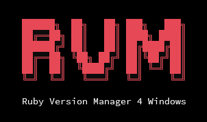

# rvm-windows

[](https://www.npmjs.com/package/rvm-windows)

[](LICENSE)



> Reimplementation of most important [rvm.io](https://www.rvm.io) features for MS Windows

As there is no rvm.io available for native windows, but only for POSIX by Cygwin, this is a reimplementation of basic [rvm.io](https://rvm.io/)
features for native MS Windows on the classic command line. It is based on the packages shipped by [rubyinstaller.org](https://rubyinstaller.org/).

RVM 4 Windows allows you to comfortably install and manage several versions of Ruby on your Windows machine.

It automatically detects `.ruby-version` files or ruby version definitions in Gemfiles and runs your project on the classic windows command line on the specified ruby version automatically.

Beneath you can switch your ruby version instantly.

Ruby environment configuration are managed by RVM per user in `C:\Users\%USERNAME%\.rvm` but stored for all users in `C:\ProgramData\rvm` by default.

```diff
- Release candidate 0.9.9! Test and share feedback! Thank you!
```


> The goal of this project is not to 100% reimplement all features of 
> rvm.io, but the most important and common ones by preserving most of the
> same command line interface. Some special Windows related stuff is added as well.

# Table of contents

* [Features & Limitations](#features)
* [Commands](#commands)
* [Usage](#usage)
* [Installation](#installation)
* [Troubleshooting](#troubleshooting)
* [Contributing](#contributing)


<a name="features"></a>
### Features & Limitations
* Support automatic installation only for rubies from rubyinstaller starting from 2.4.x and x64 architecture. But you may add older installed rubies manually by using the `rvm add <path>` command.
* Windows 10 or later
* Classic command line and Powershell
* Automatic recognition of `.ruby-version` files with autoswitch
* Experimental `rvm kit` command with recipes for several ruby versions to install common used native gems.
* When setting a proxy, the HTTP_PROXY and HTTPS_PROXY env will be temporary set, when running any rvm oder ruby command

<a name="commands"></a>
### Commands
The following commands are available in rvm-windows:

```ruby
add <path>                 # Add a installed ruby environment to the list (alias: mount)
automount                  # Scan for ruby installations and add them to the RVM configuration (alias: scan)
config                     # Print current RVM config
config default             # Print default version
config default <version>   # Set default version
config proxy               # Get the configured proxy host.
config proxy <host>        # Set the proxy server host. E.g. http://proxy:12345
config proxy delete        # Remove the proxy server host from the configuration.
current                    # Print current ruby environment version
default                    # Use default ruby version (alias: rvm use default)
delete <version>           # Delete given ruby environment (alias: remove)
fix                        # Automatically fix paths and versions in RVM configuration
get                        # Upgrade RVM to its latest release version
help                       # Print this usage guide
info                       # Show the environment information for current ruby
init                       # Initialize RVM by adding it to the PATH environment variable
install <version>          # Install a specific ruby version
kick <version>             # Only remove given ruby environment from the RVM list without deleting any ruby environment.
kit                        # Experimental: Install a bunch of widely used x64 dependencies automatically to the current ruby environment, which are needed to build native gems like postgresql, mysql2, ... 
list                       # List all installed ruby versions managed by RVM
list verbose               # List all installed ruby versions managed by RVM with additional info
list known                 # List all installable ruby versions with latest patch version
list all                   # List all installable ruby versions
mount <path>               # Add a installed ruby environment to the list (alias: add <path>)
reinstall <version>        # Delete given ruby environment and install it again.
remove <version>           # Delete given ruby environment (alias: uninstall)
scan                       # Scan for ruby installations and add them to the RVM configuration (alias: automount)
system                     # Use the system ruby (alias: rvm use system)
uninstall <version>        # Delete given ruby environment (alias: remove)
upgrade <version>          # Upgrade given version to its latest patch version
upgrade <from> <to>        # Upgrade given from_version to given to_version
use <version>              # Switch to specified ruby version
version                    # Display RVM build version
```


<a name="usage"></a>

## Usage

### Usage examples

#### List installed rubies
```bash
rvm list
```

<div style="background: black; color: white; border-radius: 16px;">
<pre>
 * <span style="color: green">ruby-3.2.2</span>
   <span style="color: green">ruby-2.4.10</span>
=> <span style="color: green">ruby-2.7.8</span>
<br/>
&#35; => - current
&#35; =* - current && default
&#35;  * - default
</pre>
</div>


#### List installable rubies
```bash
rvm list known
```

<div style="background: black; color: white; border-radius: 16px;">
<pre>
 - ruby-3.3.0
 - ruby-3.2.3
 - <span style="color: green">ruby-3.2.2</span>
 - ruby-3.2.1
 - ruby-3.2.0
 - ruby-3.1.4
...
 - ruby-3.0.2
 - ruby-3.0.1
 - ruby-3.0.0
 - <span style="color: green">ruby-2.7.8</span>
 - ruby-2.7.7
 - ruby-2.7.6
 - ruby-2.7.5
...
 - ruby-2.5.1
 - <span style="color: green">ruby-2.4.10</span>
 - ruby-2.4.9
...
 - ruby-2.4.4
 - ruby-2.4.4
</pre>
</div>


#### Switch version
You do not need to prefix `ruby-`
```bash
rvm use 2.4.10
```

<div style="background: black; color: white; border-radius: 16px;">
<pre>
Using <span style="color: green">ruby-2.4.10</span> ...
</pre>
</div>

You even do not need to specify the exact version, it will automatically use or install the highest one available!
```bash
rvm use 2
```

<div style="background: black; color: white; border-radius: 16px;">
<pre>
Using <span style="color: green">ruby-2.7.8</span> ...
</pre>
</div>

#### Install new version
```bash
rvm install 3.2
```

<div style="background: black; color: white; border-radius: 16px;">
<pre>
<span style="color: green">Installing ruby-3.2.3 ...</span>

...
</pre>
</div>


<a name="installation"></a>

## Installation

### Requirements
rvm-windows requires
* Windows >= 10.x
* NodeJS >= 18.x


### Setup
You can either use npm or yarn to install *rvm-windows*.

Ensure that NodeJS >= 18.x is already installed.

Then on your command line execute the following command:

#### yarn

```bash
yarn global add rvm-windows
```

#### npm

```bash
npm install -g rvm-windows
```

After installing the command `rvm` is available on the command line.


<a name="troubleshooting"></a>

## Troubleshooting

### Does not run the selected ruby
Check if in your system wide PATH setting some ruby environment is listed and remove it from the system PATH variable.

Otherwise try
```
rvm init
```
or
```
rvm fix
```
again.


<a name="contributing"></a>

## Contributing

Bug reports and pull requests are welcome on GitHub at https://github.com/magynhard/rvm-windows. This project is
intended
to be a safe, welcoming space for collaboration, and contributors are expected to adhere to
the [Contributor Covenant](http://contributor-covenant.org) code of conduct.

